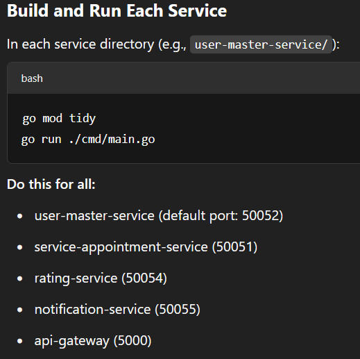

# Beauty Salon Platform — Microservices Project

This project is a modern microservice-based backend for a beauty salon booking system.  
All core business logic is split into separate Go microservices communicating via gRPC and event-driven messaging (NATS).

---

## **Architecture Overview**

- **user-master-service**  
  User registration, authentication, user and master profile management.

- **service-appointment-service**  
  Service catalog CRUD and appointment (booking) management.

- **rating-service**  
  Ratings/reviews for masters, listing and deleting reviews.

- **notification-service**  
  Receives events (like new appointment) via NATS and stores notifications for users.

- **api-gateway**  
  Single entry point for all gRPC requests. Proxies calls to internal services, handles logging, and writes logs to file.

- **Infrastructure**  
  - **PostgreSQL**: Each service uses its own schema/tables
  - **Redis**: Caching for read-heavy endpoints
  - **NATS**: Asynchronous events (pub/sub) for cross-service communication

---

## **Key Features**

- Clean microservice separation, gRPC APIs, modular code
- Event-driven architecture (NATS) for notifications, decoupled services
- Redis caching on read-heavy endpoints (e.g., GetMasterById)
- API Gateway with logging (logrus, logs to file)
- Full booking flow: user registration → booking → notification → rating
- Data integrity: foreign keys, validation, error handling

---

## **How to Run**

### **Requirements**
- Go 1.20+
- Docker (for Postgres, Redis, NATS)
- or install services manually (optional)

### **Quick Start (Docker way)**
You can spin up Postgres, Redis, and NATS in Docker:

### docker
```bash
docker run -d --name pg -e POSTGRES_USER=postgres -e POSTGRES_PASSWORD=postgres -e POSTGRES_DB=bs_bd -p 5432:5432 postgres:15
docker run -d --name redis -p 6379:6379 redis:8
docker run -d --name nats -p 4222:4222 nats:2
```



## **How It Works (Flow)**

1. **User registers** via API Gateway.
2. **User books an appointment**.  
    → `appointment-service` saves the booking and publishes an `appointment.created` event to NATS.
3. **notification-service** consumes the event and writes a notification for the user.
4. **User checks notifications** via a gRPC call to the API Gateway.
5. **User rates the master** after the service is completed.

---

## **Logs**

- All gateway logs are written to `api-gateway/gateway.log`.
- You can monitor, tail, or ship these logs to ELK/Graylog, etc.

---

## **Extending/Production Notes**

- **Monitoring**: Ready for integration with Prometheus.
- **Centralized Logging**: Compatible with ELK stack or similar solutions.
- **REST Support**: Can be extended with `grpc-gateway` for RESTful APIs.
- **Scalability**: Easily add more microservices as needed.
- **Frontend Integration**: Build a web or mobile frontend to interact with the API Gateway.

---

## **Authors**

- Project by [A. Shangilov, D. Trudkhanov, M. Zhanaev / SE-2311].
